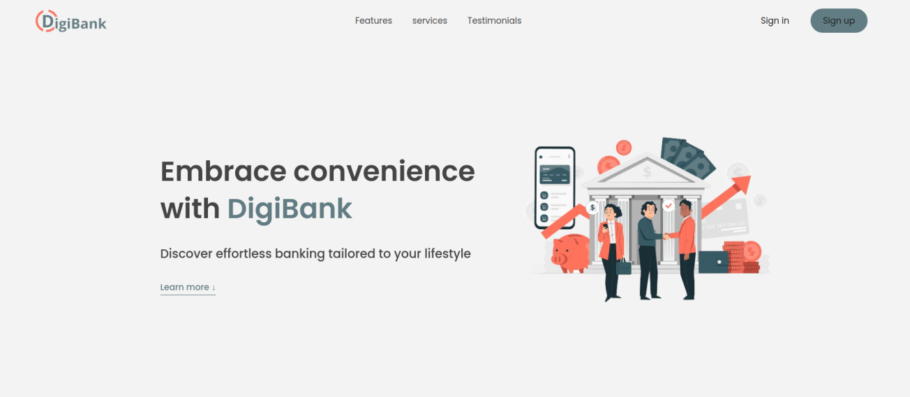

# DigiBank : Online Banking Web Application


DigiBank is an online banking web application designed to emulate the core functionalities of a bank's online service. Our application offers users the ability to manage their finances conveniently through the web.  DigiBank provides a secure, intuitive platform for a variety of banking activities, all accessible from the comfort of your home or office.

## The Solution Architecture


## Environment Setup

To manage Python versions and isolate project dependencies we recommended to create a new virtual environment named venv, a directory that contains a Python installation for a particular version of Python.
To do that follow these steps :

```bash
sudo apt update
sudo apt install python3.8
sudo apt-get install python3.8-venv
python3 -m venv venv
source venv/bin/activate
```

## Installation

Clone and set up the DigiBank application on your local machine:

```bash
  git clone [Repository URL]
  cd DigiBank
  pip3 install -r requirements.txt
```
For testing, configure your database as follows:

1. MongoDB Installation:

Follow the instructions at https://www.mongodb.com/docs/v4.4/tutorial/install-mongodb-on-ubuntu/

2. Redis Installation:

```bash
sudo apt install redis-server

```

## Usage/Examples

1. Start the API:

- In a container, execute the following command to start your API:

```bash

 python3 -m api.v1.app

```
2. Launch the Web Server:

- In a new container, run the command to start your web server locally:

```bash
 python3 -m web_dynamic.user-flask

```
3. Run Redis:

- In a new container, start Redis:

```bash
redis-server &

```

4. Accessing the Application:

- Navigate to http://127.0.0.1:5000/ in your browser to test the application.

5. Port Forwarding (for VM users):

- Make sure to expose port 5000 and 5001 if you are using a VM machine, for   example if you are using Vagrant:

In your Vagrantfile add this :

```bash
config.vm.network :forwarded_port, guest: 5001, host: 5001
config.vm.network :forwarded_port, guest: 5000, host: 5000
```


6. API Documentation with Swagger:

- To test API routes with Swagger, visit http://127.0.0.1:5001/swagger

## Features of this web application

- User-Friendly Home Page: 
Navigate through DigiBank application to know more about it's services with an easy-to-use interface.

- Account Management: 
 Create and manage your bank account with ease, users can sign up and sign in using their email addresses, in order to access to their application.

- Secure Money Transfers:
 Transfer funds to registered accounts within the application securely.

- Express Credit Access:
 Apply for and manage loans quickly.

- Transaction History: 
 View your last 10 transactions and access full  transaction history by generating a token in the application and include it in the request header : "Authorisation": "token" using Swagger or postman.

- Automatic Logout:
 Enhances security by automatically logging out users after 10 seconds of inactivity.

- Close Account: 
 Terminate your account on demand.

- Routes that can be tested by the client:

api/v1/infos : require authorisation using token to access user informations.
api/v1/all/movements :  require authorisation using token to access user movements.

## License

DigiBank is licensed under the MIT License.

## Want to Contribute?

Interested in contributing to DigiBank? We welcome pull requests and issue reports. Your contributions help make our application better for everyone.